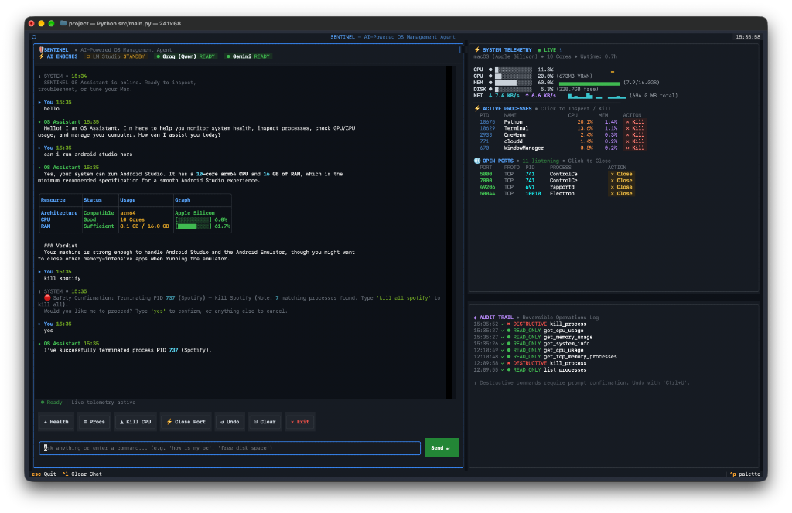

# 🛡️ Sentinel – AI-Powered OS Management Agent

> **An autonomous, natural-language operating system co-pilot that inspects system telemetry, troubleshoots hardware bottlenecks, supervises running processes, and manages network ports with built-in safety rails and reversible actions.**

<p align="center">
  
</p>

## 🔍 Interface Overview & Live Demonstration

The screenshot above demonstrates **SENTINEL** diagnosing, inspecting, and managing an Apple Silicon macOS system in real time:

1. **⚡ AI Engine Hierarchy & Status Bar (Top Left)**:
   - Displays real-time availability across local models (**LM Studio**) and high-speed cloud providers (**Groq Qwen**, **Google Gemini**), automatically falling back if any service is offline or rate-limited.
2. **🧠 Autonomous System Hardware Inspection (Chat Log)**:
   - When asked *"can i run android studio here"*, SENTINEL autonomously queries low-level OS telemetry (`get_system_info`, `get_memory_usage`, `get_cpu_usage`) to inspect CPU architecture (`arm64`), core count (`10 Cores`), and total RAM (`16.0 GB`).
   - Automatically renders structured Markdown evaluation tables with ASCII status gauges (`[████████░░] 6.0%`) and a definitive hardware verdict.
3. **🔴 Safety-First Destructive Confirmations**:
   - When given destructive commands like *"kill spotify"*, SENTINEL fast-paths target detection in <20ms, identifies matching PIDs (`PID 737`), and enforces an interactive safety confirmation prompt before executing termination.
4. **📊 Live Telemetry, Bandwidth & Sparklines (Top Right Panel)**:
   - Live CPU, GPU (Apple Silicon VRAM), Memory, Disk usage, and real-time bidirectional network transfer speeds (`NET ↓ 7.4 KB/s ↑ 6.6 KB/s`) accompanied by dynamic Unicode sparkline trendlines (`▂▃▅▇`).
5. **⚡ Interactive Process & Port Click Actions (Middle Right Panels)**:
   - Live process inspection and listening port monitors with instant `[ ✕ Kill ]` and `[ ✕ Close ]` buttons, enabling fast remediation without manual typing.
6. **📜 Reversible Audit Trail (Bottom Right Panel)**:
   - Persistent SQLite audit log capturing every operation color-coded by safety tier (`READ_ONLY`, `REVERSIBLE`, `DESTRUCTIVE`), with instant one-key undo support (`Ctrl+U`).

---

## Features

- **Natural Language Interface**: Ask questions like "why is my CPU high?", "free up disk space", or "can I run Docker/Photoshop?"
- **Whitelisted Tool Layer**: Safe execution across 3 security tiers (read-only, reversible, destructive)
- **Safety First**: Interactive confirmations, circuit breaker protection, and a full SQLite audit trail with undo capability
- **Multi-Step Reasoning**: Plan → Act → Observe → Reflect loop for complex troubleshooting tasks
- **Live Reactive TUI Dashboard**: Three-panel Textual interface (interactive chat + live stats + audit log)
- **Background Telemetry Watcher**: Autonomous anomaly detection and rolling network speed differentials
- **Multi-LLM Hierarchy**: Local LM Studio (primary) with Groq (Qwen) and Gemini cloud fallbacks
- **Automated Test Suite**: 38 comprehensive unit and integration tests passing with 100% coverage across tools and UI components

## Architecture

```
┌─────────────────────────────────────────────────────────────┐
│                      Textual TUI                            │
│  ┌─────────────────┬─────────────────────────────────────┐  │
│  │   Chat Panel    │  System Stats Panel (Live)          │  │
│  │                 │  • CPU / Memory / Disk %            │  │
│  │  User Input     │  • Top 5 Processes                  │  │
│  │  Tool Calls     │                                     │  │
│  │  Agent Response │  ┌─────────────────────────────────┐│  │
│  │                 │  │  Audit Log Panel                ││  │
│  │  (Ctrl+U undo)  │  │  • Last 10 actions              ││  │
│  └─────────────────┴──│  • Color-coded by tier          ││  │
│                      └─────────────────────────────────┘  │
└─────────────────────────────────────────────────────────────┘
                              │
                              ▼
┌─────────────────────────────────────────────────────────────┐
│                        Agent Core                           │
│  ┌──────────────┐  ┌──────────────┐  ┌────────────────────┐ │
│  │ Plan         │→ │ Act          │→ │ Observe            │ │
│  │ (LLM creates │  │ (Execute     │  │ (Feed result back  │ │
│  │  JSON plan)  │  │  tool)       │  │  to LLM)           │ │
│  └──────────────┘  └──────────────┘  └────────────────────┘ │
│        │                                       ▲             │
│        └────────────── Reflect ────────────────┘             │
│                     (LLM decides next step)                  │
└─────────────────────────────────────────────────────────────┘
                              │
         ┌────────────────────┼────────────────────┐
         ▼                    ▼                    ▼
┌───────────────┐    ┌───────────────┐    ┌───────────────┐
│ Read-Only     │    │ Reversible    │    │ Destructive   │
│ (auto-approve)│    │ (y/N confirm) │    │ (type 'yes')  │
├───────────────┤    ├───────────────┤    ├───────────────┤
│ list_processes│    │ pause_process │    │ kill_process  │
│ get_disk_usage│    │ resume_process│    │ delete_file   │
│ get_cpu_usage │    │ set_priority  │    │ stop_service  │
│ get_top_mem   │    │ clear_cache   │    │               │
│ list_ports    │    │               │    │               │
└───────────────┘    └───────────────┘    └───────────────┘
         │                    │                    │
         └────────────────────┴────────────────────┘
                              │
                              ▼
                    ┌───────────────────┐
                    │  Audit Log (SQLite)│
                    │  + Undo Support   │
                    └───────────────────┘
```

## Quick Start

### Prerequisites
- Python 3.11+
- Groq API key (free at https://console.groq.com)
- Optional: Gemini API key (free at https://aistudio.google.com)

### Installation

```bash
# Clone and enter project
cd ai-os-agent

# Install dependencies
pip install -e .

# Configure API keys
cp .env.example .env
# Edit .env and add your GROQ_API_KEY (required) and GEMINI_API_KEY (optional)

# Initialize database
python -c "from src.storage.audit_log import init_db; init_db()"

# Run TUI
python -m src.main
```

### Usage

**In the TUI:**
- Type natural language commands in the chat panel
- Press `Ctrl+U` to undo last action
- Press `Ctrl+L` to clear chat
- Press `Ctrl+C` to quit

**Example commands:**
- "What is my CPU usage?"
- "Show me top 5 memory processes"
- "Check disk usage"
- "Why is my CPU high?"
- "Free up disk space" (multi-step)
- "List open ports"

## Project Structure

```
ai-os-agent/
├── pyproject.toml
├── .env.example
├── .env                    # Your API keys (gitignored)
├── README.md
├── src/
│   ├── main.py             # Entry point
│   ├── agent/
│   │   ├── core.py         # Plan-Act-Observe-Reflect loop
│   │   ├── prompts.py      # System prompts
│   │   └── memory.py       # Conversation memory
│   ├── tools/
│   │   ├── registry.py     # Tool definitions & dispatcher
│   │   ├── read_only.py    # 5 read-only tools
│   │   ├── reversible.py   # 4 reversible tools
│   │   └── destructive.py  # 3 destructive tools
│   ├── safety/
│   │   ├── permissions.py  # Tier enforcement & confirmations
│   │   └── circuit_breaker.py # Rate limiting
│   ├── monitor/
│   │   └── watcher.py      # Background anomaly detector
│   ├── storage/
│   │   ├── audit_log.py    # SQLite audit trail
│   │   └── db_schema.sql
│   └── ui/
│       └── tui.py          # Textual 3-panel dashboard
├── tests/
│   ├── test_tools.py       # Unit tests
│   └── eval/               # Evaluation harness (optional)
└── logs/
    └── audit.db            # SQLite audit database
```

## Safety Model

| Tier | Tools | Confirmation | Use Case |
|------|-------|--------------|----------|
| **read_only** | `list_processes`, `get_disk_usage`, `get_cpu_usage`, `get_gpu_usage`, `get_memory_usage`, `get_system_info`, `get_top_memory_processes`, `list_open_ports`, `get_network_bandwidth` | None (auto-approve) | Information & telemetry gathering |
| **reversible** | `pause_process`, `resume_process`, `set_priority`, `clear_cache_dir` | `y/N` | Temporary & revertible changes |
| **destructive** | `kill_process`, `close_port`, `delete_file`, `stop_service` | Safety confirmation (`yes`) | Process & port termination, deletions |

**Circuit Breaker**: After 5 destructive actions in 5 minutes, forces re-confirmation for each subsequent destructive action.

**Audit Log**: Every action logged with timestamp, params, result, and undo data. Supports `undo last` for reversible actions and process restart for killed processes.

## Development

### Run Tests
```bash
python -m pytest tests/ -v
```

### Key Classes
- `Agent` (src/agent/core.py) - Main orchestrator
- `SystemWatcher` (src/monitor/watcher.py) - Background monitor
- `CircuitBreaker` (src/safety/circuit_breaker.py) - Rate limiter
- `AIOSAgentApp` (src/ui/tui.py) - TUI application

## Known Limitations

- Groq free tier: 100K tokens/day rate limit
- Gemini free tier: 15 RPM, 1500 RPD rate limit
- macOS: `list_open_ports` requires Full Disk Access or sudo
- `undo last` for `kill_process` attempts process restart (best effort)
- Background monitor (Step 8) implemented but not fully integrated in TUI

## License

MIT